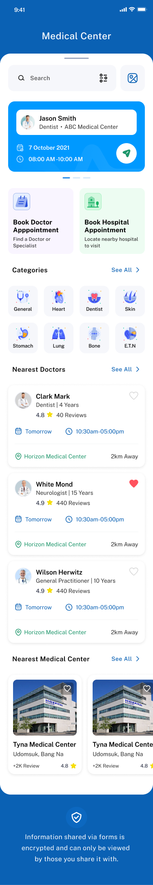

# paxform

<p align="center"></p>

A medical center technical assessment UI built with Flutter. This repository contains a small sample app that demonstrates a medical-center style dashboard with components such as appointment cards, doctor lists, category icons, and a carousel for nearby medical centers.

## Table of contents

- Project overview
- Features
- Requirements
- Installation
- Running the app
- Fonts & assets
- Project structure
- Key files
- Dependencies
- Testing, linting & verification
- Troubleshooting
- Contributing
- License & contact

## Project overview

`paxform` is a Flutter UI project intended as a technical assessment for a medical center screen. It demonstrates reusable UI components, a consistent design system (colors, sizes, text styles), and local assets including images and a multi-weight `PublicSans` font family.

The app launches directly into a `DashboardScreen` showcasing appointment information, quick actions, categories, nearest doctors, and nearby medical centers.

## App preview

<p align="center"></p>

## Features

- Curved header and footer components
- Search bar and quick action buttons
- Appointment card and slider indicator
- Grid of medical categories with SVG icons
- Scrollable list of doctors with rating and availability
- Horizontal carousel of medical centers
- Centralized constants for colors, sizes, image paths, and text styles
- Local assets: images, icons, logos and a multi-weight `PublicSans` font

## Requirements

- Flutter SDK: compatible with the project environment constraint in `pubspec.yaml` (sdk: ">=3.8.5 <4.0.0").
- A device or emulator for iOS or Android.
- Typical platform tooling (Android SDK, Xcode for iOS when building for those platforms).

## Installation

1. Clone the repository:

```bash
git clone <https://github.com/adedeni/flutter-assesment>
cd flutter-assessment
```

2. Get packages:

```bash
flutter pub get
```

3. If you open the project in an IDE (Android Studio, VS Code), ensure Flutter and Dart plugins are installed.

## Running the app

Run on an attached device or emulator:

```bash
flutter run
```

To build a release APK for Android:

```bash
flutter build apk --release
```

To build for iOS (from macOS with Xcode installed):

```bash
flutter build ios --release
```

## Fonts & assets

The project includes a multi-weight `PublicSans` font family. The fonts are declared in `pubspec.yaml` under the `flutter:` section and mapped to files inside `assets/fonts/`.

How the font is configured:
- The family name used in `pubspec.yaml` is `PublicSans`. That same family name must be used in `TextStyle.fontFamily` or set as the app-wide default via `ThemeData(fontFamily: 'PublicSans')`.

Example: set the app default font (already applied in this project in `lib/app.dart`):

```dart
return MaterialApp(
	title: ATexts.appName,
	theme: ThemeData(
		fontFamily: 'PublicSans',
		textTheme: const TextTheme(
			bodyLarge: TextStyle(fontFamily: 'PublicSans'),
			bodyMedium: TextStyle(fontFamily: 'PublicSans'),
			titleLarge: TextStyle(fontFamily: 'PublicSans'),
		),
	),
	home: const DashboardScreen(),
);
```

Important notes when working with fonts and assets:

- After changing `pubspec.yaml` (fonts or assets), run `flutter pub get` and perform a full restart of the app (not just hot reload) to ensure fonts are applied.
- If an asset is not found at runtime, verify the path matches the file system and that indentation in `pubspec.yaml` is correct (YAML is indentation-sensitive).
- The assets declared in `pubspec.yaml` include `assets/logos/`, `assets/icons/`, `assets/fonts/`, and `assets/images/`.

## Project structure

Top-level layout (key folders and files):

- `lib/main.dart` — app entry point.
- `lib/app.dart` — MaterialApp configuration and theming.
- `lib/constants/` — central design tokens and asset path constants (colors, sizes, text styles, strings, images).
- `lib/common/` — shared UI components such as appbar, icons, layouts, and text widgets.
- `lib/dashboard/` — dashboard screen, models, and widgets used to compose the main UI.
- `lib/data/mock_data.dart` — mocked data used to populate the UI components for demonstration.
- `assets/` — images, icons, logos, and font files used by the project.
- `test/widget_test.dart` — example widget test included with the project.

## Key files

- `pubspec.yaml` — dependency, asset and font declarations. The `PublicSans` font family and a set of font weights are declared here.
- `lib/app.dart` — where the app theme and default `fontFamily` are set.
- `lib/dashboard/screens/dashboard_screen.dart` — main UI screen demonstrating the app design.
- `lib/constants/text_styles.dart` — central text style definitions used across the app.
- `lib/data/mock_data.dart` — data provider for the UI demo.

## Dependencies

The main dependencies declared in `pubspec.yaml` include (versions as in project file):

- flutter (SDK)
- iconsax ^0.0.8
- cupertino_icons ^1.0.8
- flutter_svg ^2.0.10+1

Dev dependencies:

- flutter_test (SDK)
- flutter_lints ^6.0.0
- flutter_launcher_icons ^0.14.4

## Testing, linting & verification

- Run unit/widget tests:

```bash
flutter test
```

- Analyze code for issues:

```bash
flutter analyze
```

- Format code:

```bash
flutter format .
```

- If you modify fonts or assets and the app does not pick them up, try:

```bash
flutter clean
flutter pub get
flutter run
```

Quality gates to check locally:

- Build: `flutter build apk` or `flutter build ios`
- Lint/Typecheck: `flutter analyze`
- Tests: `flutter test`

## Troubleshooting

- Fonts not applied: Ensure `fontFamily` value in Flutter code exactly matches the `family:` name in `pubspec.yaml`. Restart the app fully after changing fonts.
- Asset not found: Check paths in `lib/constants/image_strings.dart` and `pubspec.yaml` and ensure files are present under `assets/`.
- Dependency issues: Run `flutter pub get` and confirm your Flutter SDK version satisfies the `environment` constraint in `pubspec.yaml`.


<p align="center"></p>

### Notes & assumptions made while writing this README

- The app is a UI-focused demo using locally-provided mock data (see `lib/data/mock_data.dart`).
- The font family is declared as `PublicSans` in `pubspec.yaml` and multiple weights are present in `assets/fonts/`.

